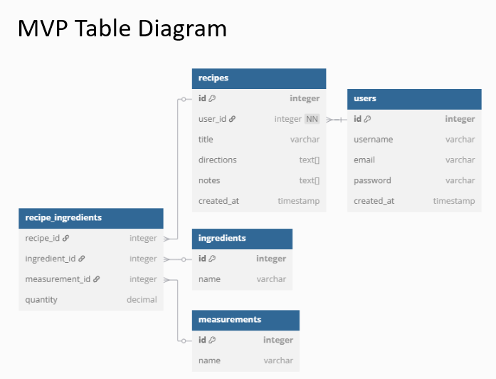

# Meal Prep


## Purpose
- Recipe tracking application allowing users to create and discover new recipes
- Streamline meal planning and preperation
- Future features: to support health and budget management

## MVP Features
- Public recipe browsing
- User authentication
- Basic recipt CRUD operations
- Search functionality

## Tech Stack
- Backend: Python/Flask
- Frontend: React/Next.js/Jotai
- Database: PostgresSQL
- ORM: SQLAlchemy

## Technical Decisions
### Backend - Flask:
- Lightweight and flexible framework
- Direct Python practice opportunity
- Excellent for Rest API development
- Previous experience reduces initial learning curve
- Clean integration with SQLAlchemy

### Database - PostgressSQL:
- Good for structured data like the recipe tables
- Strog relationship handling (to handle my junction tables)
- ACID compliant (data integrity)
- Works well with SQLAlchemy
- Better for complex queries (will be necessary with future implementation)
- Free and open source

### Database Architecture:
- Junction table for ingredients instead of JSON storage because:
    - Better long-term scalability
    - Easier ingredient standardization
    - Simplified search functionality
    - More efficient for future features like grocery lists
    - Reduces future refactoring needs
- Addition of a measurements table to:
    - Enable dynamic addition of new measurement types
    - Facilitates future conversion calculations between units
    - Standardizes measurement options across recipes
    - Makes scaling recipes more accurate and consistent
    - Supports international measurement variations 
    - Simplifies grocery list consolidation (combining ingredients with different measurements)

### Frontend - React and Next.js:
- React benifits:
    - Component reusability
    - Virtual DOM for efficient updates
    - Large community support
    - Strong ecosystem of libraries
    - Industry standard skill

- Next.js benifits:
    - Built-in documentation support 
    - Server-side rendering capabilities
    - Improved SEO potential
    - Optimized performance
    - File-based routing
    - API route support
    - Enhanced developer experience

### State Management - Jotai:
- Lightweight and simple compared to Redux
- Efficient data persistence:
    - Recipe data can be atomically stored
    - User authentication state is easily managed
    - Seach states can be preserved
- Atomic approach reduces unnexessary rerenders:
    - Recipe updates can be handled efficiently
- Familiar from current work experience
- Great for server state caching
- Easy CRUD updated
- Less boilerplate than Redux


## Database Structure 
- Users
- Recipes
- Ingredients
- Measurements
- Join Table (Recipes, Ingredients, Measurements)



## Getting Started
- Requirements:
    - Python 3.x
    - Node.js
    - PostgesSQL

- Installation:
    - Comming soon...


## Future Features:
- Google Calender integration for meal planning
- Automated grocery list generation
- Serving Size calculator
- Cost estimation per recipe/meal
- Nutritional information tracking
- Recipe scaling functionality
- Favorite recipes collection
- Meal prep organization tools
- Shopping cost tracking
- Recipe sharing between users


make a .env


App.diagrams.net
Run backend
- source activate.sh    - activate your environment
- flask run                  - start up your server


## Getting Started
(Detailed setup steps can go in a seperate contributing.md or development docs later)
- Requirements:
    - Python 3.x
    - Node.js
    - PostgesSQL
    - pip (Python package Manager)
    - npm (Node package Manager)

- Initial setup:
    - Clone repository
    - Create virtual environment
    - Install Python dependencies
    - Install Node dependencies
    - Set up PostgresSQL database


### Setting up environments
- add a .gitignore file to the root repositiory
- create a front and backend folder
### Setting up the backend
- cd into the backend
- setup your virtual environment (venv is the name of the module and venv is the path.  if there is no path it will add it in the current directory)
		```python -m venv venv```
- Add venv/ to your .gitignore
- Activate Python environment:
		```source venv/bin/activate```
- To exit the environment use command
			```deactivate```


- If you want to set up a command script: 
	  - cd into the repo with venv folder. 
	  - create an sh script file
	  - add the environment starting command
	  - in the terminal in your backend folder run 
			  ``` chmod +x activate.sh```
		  - This will execute permissions and save the permissions to the file so that you are able to run this script in the future
	  - Now you can cd into the repo with the sh script and run
			  ```source <script_name>.sh```

- Now you have your environment activated, you should have pip installed, check with command
		```pip version```
- If so install dependencies (we need flas, flask_sqlalchemy, flask_migrate, and pythos-dotenv)
		```pip install flask flask_sqlalchemy flask_migrate python-dotenv```

- Create an app.py to run your server - use to run your server
		```python app.py```
- command to be able to load environment variables automatically:
		```pip install python-dotenv```

- psycopg2 might not be included in the already installed dependencies, you may need do include it yourself
		```pip install psycopg2-binary```
- This dependency is necessary for SQLAlchemy to interact with PostgresSQL
- Make a requirements.txt file to track your dependencies with python - this command will list all installed dependencies and their versions
		```pip freeze > requirements.txt```
- If cloning down a user would need this command to install all requirements and dependencies:
			```pip install -r requirements.txt```
- You can also use this command to see what is installed in your environment:
			```pip list```
- When installing a new dependency you need to clear the requirements.txt file and then run:
			``` pip freeze > requirements.txt```

Best practice:
- **After installing a new package**, update `requirements.txt`:
    `pip freeze > requirements.txt`
    
- **Before pushing to GitHub**, check for updates:
    `pip list --outdated`
    
- **To upgrade all outdated dependencies**, use:
    `pip install --upgrade -r requirements.txt`
    
- **Before pulling changes from Git**, check if `requirements.txt` has changed:
    `git pull origin main  # or your branch pip install -r requirements.txt`


### PostgresSql install:
	- sudo apt update
	- sudo apt install postgresql postgresql-contrib
- check to see if it is running:
	- sudo systemctl status postgresql
- If it is not running start it with this:
	- sudo systemctl start postgresql
- Open the postgresSQL command props
	- sudo -u postgres psql
- Exit 
	  - \l


### Initialize your database
	`flask db init
flask db migrate -m "Initial migration"
flask db upgrade


To check if postgress is running:
	- sudo systemctl status postgresql

To activate postgress:
	- sudo systemctl start postgresql

To set postgress to start automatically on boot
	- sudo systemctl start postgresql

To enter postgress with a specific table in the terminal:
	- psql -U <username> -d <DB name>
	- psql -U llfbh33 -d mealprep

To get all the tables withing the database:
	- \dt

To see all the data within a specific database:
	- SELECT * FROM <table>;
	- SELECT * FROM users;

To exit postgres:
	- \q

### Create your Migrations
		- Make sure that the app and database are properly initialized in the app.py before running migration commands. If they are not you may have to clear out migrations and database and start over.

		- Creates migrations folder with necessary configuration files but no actual migration files yet
				- Flask db init


### Create a Table 
Create a new model file
Create a new seed file
Create a migration for the new table
	- Compare your models to the current state of the database and generate necessary migrations with command:
		- flask db migrate -m "Create items table"
Apply the migrations to the database with command
	- flask db upgrade
Add your seeds to the database with command
	- python seeds/items_seed.py

### Possible Bugs
- the system is trying to use the system username and there is no user
	- Switch to the postgres user:
		- sudo -i -u postgres
	- Create role for user:
		- psql
CREATE ROLE llfbh33 WITH LOGIN SUPERUSER CREATEDB CREATEROLE PASSWORD 'your_password';
\q


Some SQL commands

		- Basic Queries
- SELECT * FROM users;
- SELECT username, email FROM users;
- SELECT * FROM users LIMIT 10;
- SELECT * FROM users WHERE id = 1;

		- Filtering and Sorting
- SELECT * FROM users WHERE username = 'admin' AND email = 'admin@example.com';
- SELECT * FROM users WHERE username = 'admin' OR username = 'user2';
- Select all from recipes table ordered alphabetically by title
	- SELECT * FROM recipes ORDER BY title;
- Select all from recipes table ordered by title in decending order
	- SELECT * FROM recipes ORDER BY title DESC;

		- Aggregating Data
- Count the number of rows in the users table
	- SELECT COUNT(*) FROM users;
- Find the max(id) from users
	- SELECT MAX(id) FROM users;
- Groupp the rows in the recipes table by user_id and count how many recipes each user has
	- SELECT user_id, COUNT(*) FROM recipes GROUP BY user_id
- Calculate the average price from the recipes table
	- SELECT AVG(price) FROM recipes;

		- Joining Tables
- Joins the recipes table with the users table on the user_id column, selecting the title of the recipe and the username of the user who created it
	- SELECT recipes.title, users.username
	FROM recipes
	JOIN users ON recipes.user_id = users.id;


## Purpose
- Recipe tracking application allowing users to create and discover new recipes
- Streamline meal planning and preperation
- Future features: to support health and budget management

## MVP Features
- Public recipe browsing
- User authentication
- Basic recipt CRUD operations
- Search functionality  

## Tech Stack
- Backend: Python/Flask
- Frontend: React
- Database: PostgresSQL
- ORM: SQLAlchemy

## Database Structure
- Users
- Recipes
- Ingredients
- Measurements

